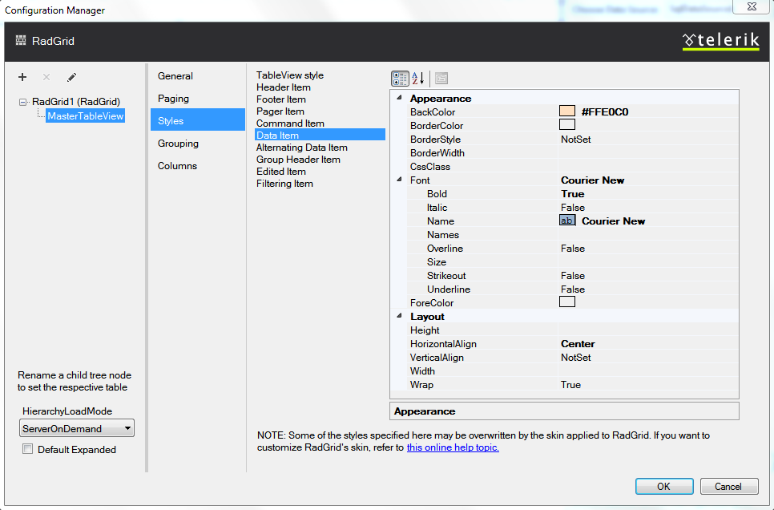

# Styling from Design-Time

The Styles section lets you fully customize the appearance of Telerik RadGrid. Here you can set the colors for the grid elements, the style for the strings and the element alignment.

>caution You can set the whole look and feel of the grid by using one of the provided skins or define your own. Set the Skin property or use the AutoFormat command in the Smart Tag to specify which skin will be used. See [Skins](https://www.telerik.com/help/aspnet-ajax/howskinswork.html) topic for details.
>

## Object tree

This tree shows the customizable Telerik RadGrid objects. The first tree node presents settings for the whole grid. The Nodes next to it present settings for specific grid elements.

If you use custom column-bounding the columns node will appear. When you use the automatic columns generation you will not see the Columns settings.

## Appearance

This section of the dialog is common for all objects in the Object tree. Here you can set the appearance options for the data item element.Below are the customization options:

* **Fore color** - the color of the text

* **Back Color** - the color of the text background

* **Font Name** - the font for the text of the selected element

* **Font Size** - the font size in the selected units

Below are the layout options:

* **Horizontal Alignment** - left, right or center

* **Vertical Alignment** - top, middle, bottom
