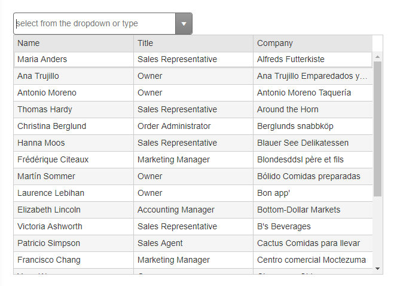

# Getting Started 

The following tutorial demonstrates how you can add **RadMultiColumnComboBox** bound to SqlDataSource control. The end result will be similar to **Figure 1**:

>caption Figure 1: RadMultiColumnComboBox bound to SqlDataSource control

1. Add a **ScriptManager** control on a Web Form.

1. Create a data source with your preferred method. For example:

    **ASPX**
    
        <asp:SqlDataSource runat="server" ID="SqlDataSource1" ConnectionString="<%$ ConnectionStrings:NorthwindConnectionString %>"
        ProviderName="System.Data.SqlClient"
        SelectCommand="SELECT Top 20 [CustomerID], [ContactName], [ContactTitle], [CompanyName] FROM [Customers]"></asp:SqlDataSource>

1. Add a **RadMultiColumnComboBox** control to the page, and set its properties:

    * `DataSourceID` - points to the SqlDataSource control ID.
    * `DataTextField` and `DataValueField` - point them to the respective fields of the data source.
    * `FilterFields` - these are the fields from the data source that will be used for filtering the text the user types. Set them according to the data source and your UX preferences.
    * `Filter` - set it to "`contains`" to enable generic filtering.
    * `Placeholder`, `DropDownWidth`, `Height` and `Width` control its appearance much like with other inputs and dropdowns.
    * Populate the `ColumnsCollection` with `MultiColumnComboBoxColumn` instances and set their properties:
    
        * `Field` - the field from the data source that will be rendered.
        * `Title` - the header text.
        * `Width`d - the width of the column. They should add up to the value of DropDownWidth.
        
    The end result should be similar to the following:

    **ASPX**
    
        <telerik:RadMultiColumnComboBox runat="server" ID="RadMultiColumnComboBox1" DataSourceID="SqlDataSource1"
            DropDownWidth="600px" Height="400px" Width="100%"
            Filter="contains" FilterFields="ContactName, ContactTitle, CompanyName"
            DataTextField="ContactName" DataValueField="CustomerID"
            Placeholder="select from the dropdown or type" Skin="Default">
            <ColumnsCollection>
                <telerik:MultiColumnComboBoxColumn Field="ContactName" Title="Name" Width="200px" />
                <telerik:MultiColumnComboBoxColumn Field="ContactTitle" Title="Title" Width="200px" />
                <telerik:MultiColumnComboBoxColumn Field="CompanyName" Title="Company" Width="200px" />
            </ColumnsCollection>
        </telerik:RadMultiColumnComboBox>

