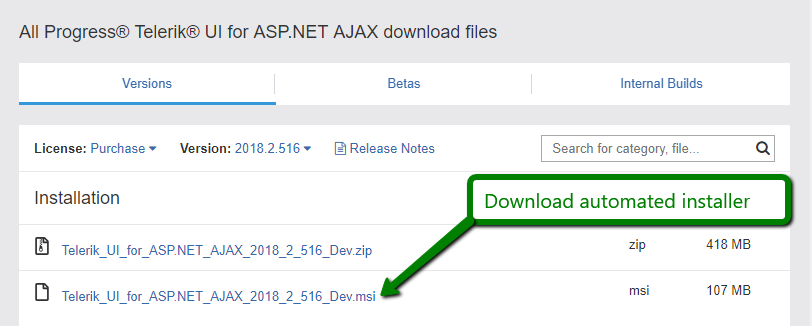
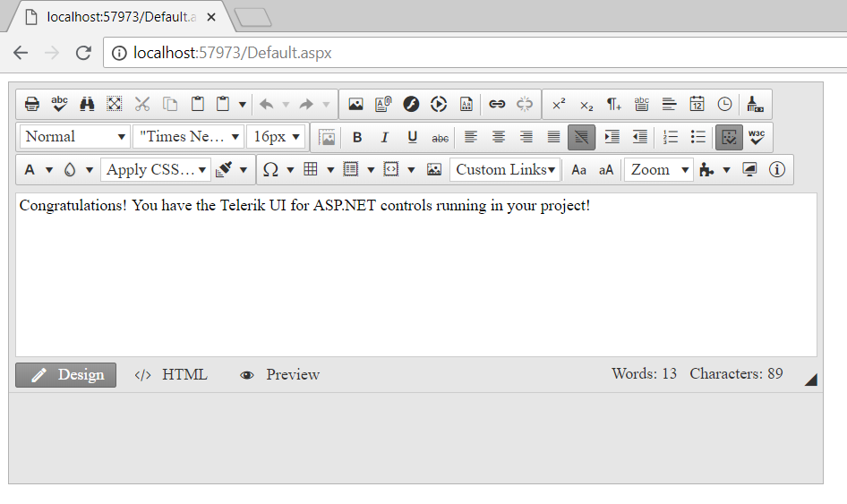

# First Steps with UI for ASP.NET AJAX

This article explains how to get the Telerik UI for ASP.NET AJAX controls in your project and start using them quickly. The process consists of the following steps:

1. [Download the Controls](#download-the-controls)
1. [Add the Controls to Your Project](#add-the-controls-to-your-project)
1. [Add a Control to a Page](#add-a-control-to-a-page)

Once you have your first simple control up and running, take a look at the [next steps](#next-steps) section to start exploring the control functionality in more detail.

## Download the Controls

The easiest way to get the controls to your development machine is to use the [Telerik Control Panel](https://www.telerik.com/download-trial-file/v2/control-panel) or to download the [automated MSI installer]() from [Your telerik.com account](https://www.telerik.com/account/product-download?product=RCAJAX).

>caption Figure 1: Download automated (.msi) installer

>note If you are not a customer, you can [download a free, fully functional trial](https://www.telerik.com/download-trial-file/v2-b/ui-for-asp.net-ajax) and the same options will apply to you as well.

>tip The following article can help you choose the installation type that is most suitable for your needs and preferences: [Which File Do I Need to Install](https://docs.telerik.com/devtools/aspnet-ajax/installation/which-file-do-i-need-to-install).

## Add the Controls to Your Project

The easiest way to get the Telerik UI for ASP.NET AJAX controls in your project is to:

1. Install the [Telerik AJAX Visual Studio Extensions](https://marketplace.visualstudio.com/items?itemName=TelerikInc.TelerikASPNETAJAXVSExtensions). You can easily do this in Visual Studio - go to **Tools** > **Extensions and Updates** >  **search** the **Online** Visual Studio Marketplace for "**telerik asp.net ajax vsextensions**".

    Make sure that you restart VS to allow it to install the extensions.

    >caption Figure 2: Get the Telerik AJAX VS Extensions

    

1. Reference the controls in your project:

    * If you already **have a WebForms project**, run the [Convert Project Wizard]().
    
        >caption Figure 3: Go to Telerik > UI for ASP.NET AJAX > Convert to Telerik Web Application

        

    * If you **do not have a project**, run the [Create Project Wizard]().

        >caption Figure 4: Go to Telerik > UI for ASP.NET AJAX > Create new Telerik Project

        

>tip If you prefer full manual control over your project, you can **copy** the **Telerik assemblies** to the `~/bin` and **add references** to them through the Visual Studio interface. In this case you should also [update the web.config](https://docs.telerik.com/devtools/aspnet-ajax/general-information/web-config-settings-overview#mandatory-additions-to-the-webconfig). The controls come packaged in [several assemblies](https://docs.telerik.com/devtools/aspnet-ajax/installation/included-assemblies) and to get started, you only need `Telerik.Web.UI.dll`, `Telerik.Web.UI.Skins.dll` and `Telerik.Web.Design.dll`.

## Add a Control to a Page

The final step is to actually use a control on a page and run it in the browser:

1. **Add** a **ScriptManager** control on top of the page in which you are going to add a Telerik control. This is required by any MS AJAX-based control.

    **ASPX**

        <form id="form1" runat="server">
            <telerik:RadScriptManager ID="RadScriptManager1" runat="server">
            </telerik:RadScriptManager>

1. **Register the Telerik namespace** with the project:

    * To **register** the namespace **on all pages** and user controls, add the following to your `web.config`:

        **web.config**

              <system.web>
                <pages>
                    <controls>
                        <add tagPrefix="telerik" namespace="Telerik.Web.UI" assembly="Telerik.Web.UI" />
                    </controls>
                </pages> 

    * If you want the controls available **on the current page only**, add the following Register directive just below the `<%@ Page %>` directive:

        **ASPX**

            <%@ Register TagPrefix="telerik" Namespace="Telerik.Web.UI" Assembly="Telerik.Web.UI" %> 

1. **Add a Telerik control** to the page, for example, a [RadEditor](https://demos.telerik.com/aspnet-ajax/editor/examples/overview/defaultcs.aspx):

    **ASPX**

        <form id="form1" runat="server">
            <telerik:RadScriptManager ID="RadScriptManager1" runat="server">
            </telerik:RadScriptManager>
            <telerik:RadEditor runat="server" ID="RadEditor1" RenderMode="Lightweight">
                <Content>
                    Congratulations! You have the Telerik UI for ASP.NET controls running in your project!
                </Content>
            </telerik:RadEditor>

    * You can also **drag** a control **from** the **Toolbox**. If you do not see the controls in the toolbox, examine the Adding the [Telerik Controls to the Visual Studio Toolbox]() article.

1. **Run the page** in the browser by pressing `F5`. You should see something like this:

    >caption Figure 5: The final result

    

## Next Steps

Now that you have the Telerik UI for ASP.NET AJAX controls running in your project, you may want to explore their features, customize their behavior or change their appearance. Below you can find guidance on getting started with such tasks:

* [Explore control features]()
* [Customize control behavior]()
* [Change control appearance]()
* [Further information]()

## See Also

* [System Requirements](https://www.telerik.com/aspnet-ajax/tech-sheets/system-requirements)
* [Browser Support](https://www.telerik.com/aspnet-ajax/tech-sheets/browser-support)
* [Progress Virtual Classroom](https://www.telerik.com/account/support/virtual-classroom)
